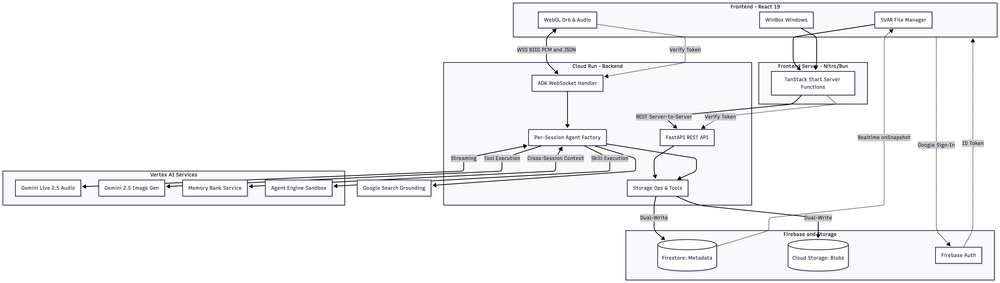

# Asist0 - Agentic Workspace: Architecture

Asist0 is a voice-first AI workspace built on the [Google Agent Development Kit (ADK)](https://google.github.io/adk-docs/). This document covers the complete system design — every Google service integration, every ADK feature used, and every data flow.



## System Overview

```
┌─────────────────────────────────────────────────────────────────────────────┐
│                            BROWSER (React 19)                               │
│                                                                             │
│  ┌─────────────────────┐  ┌──────────────────┐  ┌───────────────────────┐  │
│  │ SVAR File Manager   │  │ WinBox Windows   │  │ WebGL Orb (72px)      │  │
│  │ • Firestore realtime│  │ • CodeMirror 6   │  │ • Audio Capture 16kHz │  │
│  │   onSnapshot sync   │  │ • Markdown prev. │  │ • Audio Playback 24kHz│  │
│  │ • Drag-drop upload  │  │ • Image viewer   │  │ • Mic toggle only     │  │
│  │ • Context menus     │  │ • PDF viewer     │  │ • Shows after WS conn │  │
│  └────────┬────────────┘  │ • Refresh button │  └───────────┬───────────┘  │
│           │               │ • Cmd+S save     │              │              │
│           │               └──────────────────┘              │              │
│           │                                                 │              │
│  ┌────────▼────────────────────────────┐   ┌───────────────▼───────────┐  │
│  │ TanStack Start Server Functions     │   │ WebSocket (direct to API) │  │
│  │ • File CRUD (create, rename, delete)│   │ • Always-on (auto-connect)│  │
│  │ • Upload (base64 → multipart)       │   │ • Auto-reconnect (exp.   │  │
│  │ • Download, content read/write      │   │   backoff, 5 retries)    │  │
│  │ • Workspace save/restore            │   │ • Binary: PCM audio      │  │
│  │ • Drive info                        │   │ • JSON: text, image,     │  │
│  │ Runs on Nitro/Bun (no CORS)        │   │   events                 │  │
│  └────────┬────────────────────────────┘   └───────────────┬───────────┘  │
└───────────┼────────────────────────────────────────────────┼──────────────┘
            │ REST (server-to-server)                        │ WSS (direct)
            ▼                                                ▼
┌─────────────────────────────────────────────────────────────────────────────┐
│                     CLOUD RUN — BACKEND (FastAPI + ADK)                      │
│                                                                             │
│  ┌──────────────────────────────────────────────────────────────────────┐   │
│  │                        WebSocket Handler                             │   │
│  │  1. Verify Firebase token → extract user_id                         │   │
│  │  2. Load user skills (skill_loader → Firebase Storage)              │   │
│  │  3. Create file tools (agent_tools → closures over user_id)         │   │
│  │  4. Build per-session Agent (create_agent factory)                  │   │
│  │  5. Create Runner (agent + session_service + memory_service)        │   │
│  │  6. Create fresh session (VertexAiSessionService)                   │   │
│  │  7. Configure RunConfig (BIDI, audio, resumption, compression)      │   │
│  │  8. Start bidirectional streaming (upstream + downstream tasks)     │   │
│  │  9. On disconnect: save session to Memory Bank                      │   │
│  └──────────────────────────────────────────────────────────────────────┘   │
│                                                                             │
│  ┌──────────────────┐  ┌──────────────────┐  ┌──────────────────────────┐  │
│  │ File REST API    │  │ Workspace REST   │  │ Auth Middleware           │  │
│  │ GET/POST/PUT/DEL │  │ GET /workspace   │  │ HTTPBearer → verify_id_  │  │
│  │ /files, /upload  │  │ PUT /workspace   │  │ token() → user_id        │  │
│  │ /download, /info │  │                  │  │                          │  │
│  └────────┬─────────┘  └────────┬─────────┘  └──────────────────────────┘  │
│           │                     │                                           │
│  ┌────────▼─────────────────────▼──────────────────────────────────────┐   │
│  │                      storage_ops.py                                  │   │
│  │  Pure functions (no FastAPI dependency) — used by REST + agent tools │   │
│  │  • Dual-write: Cloud Storage (blobs) + Firestore (metadata)         │   │
│  │  • list/create/rename/delete/move/upload/download files              │   │
│  │  • Workspace layout get/save                                        │   │
│  │  • New user seeding (4 default skills)                              │   │
│  └─────────────────────────────────────────────────────────────────────┘   │
└──────────┬──────────────┬──────────────┬──────────────┬─────────────────────┘
           │              │              │              │
           ▼              ▼              ▼              ▼
┌───────────────┐ ┌──────────────┐ ┌──────────┐ ┌──────────────────────┐
│ Firebase      │ │ Firestore    │ │ Vertex AI│ │ Agent Engine          │
│ Storage       │ │              │ │          │ │                      │
│ gs://bucket/  │ │ users/{uid}/ │ │ Gemini   │ │ Session Service      │
│ users/{uid}/  │ │  files/{id}  │ │ Live API │ │ Memory Bank Service  │
│ {path...}     │ │  workspace/  │ │          │ │ Sandbox Executor     │
│               │ │  layout      │ │ Image    │ │                      │
│ (file blobs,  │ │              │ │ Gen API  │ │ (project/location/   │
│  skill files) │ │ (metadata,   │ │          │ │  reasoningEngines/   │
│               │ │  realtime)   │ │          │ │  {engine_id})        │
└───────────────┘ └──────────────┘ └──────────┘ └──────────────────────┘
```

## Google Services Used

| Service | Purpose | Where |
|---------|---------|-------|
| **Gemini Live 2.5 Flash Native Audio** | Voice model — bidirectional audio streaming | `agent.py`, `main.py` RunConfig |
| **Gemini 2.5 Flash Image** | Image generation and editing | `agent_tools.py` via `genai.Client` |
| **Google Search Grounding** | Real-time web search for current events, weather, news, etc. | `agent.py` — `google_search` tool |
| **Vertex AI Session Service** | Per-connection session storage | `main.py` — `VertexAiSessionService` |
| **Vertex AI Memory Bank** | Long-term memory across sessions | `main.py` — `VertexAiMemoryBankService` |
| **Agent Engine** | Sandbox code execution for skill scripts | `agent.py` — `AgentEngineSandboxCodeExecutor` |
| **Firebase Authentication** | Google Sign-In, token verification | Frontend client SDK + backend Admin SDK |
| **Cloud Firestore** | File metadata index, realtime sync, workspace layout | Admin SDK (backend) + client SDK (frontend `onSnapshot`) |
| **Firebase Cloud Storage** | File blobs, skill files | Admin SDK via `storage_ops.py` |
| **Cloud Run** | Backend (FastAPI+ADK) + Frontend (TanStack Start) | Two services, custom domain mappings |
| **Artifact Registry** | Docker image storage | `us-central1-docker.pkg.dev` |
| **Cloud Build** | Docker image builds | Via Pulumi Docker provider |

### IAM Roles (Backend Service Account)

| Role | Access |
|------|--------|
| `roles/aiplatform.user` | Vertex AI — Gemini models, Agent Engine, sessions, memory |
| `roles/datastore.user` | Firestore — read/write file metadata + workspace layout |
| `roles/storage.objectAdmin` | Cloud Storage — full object access for file operations |
| `roles/iam.serviceAccountTokenCreator` | Token generation for signed URLs |

## ADK Integration

### Classes and Features Used

| ADK Class | Import | Purpose |
|-----------|--------|---------|
| `Agent` | `google.adk.agents` | Per-session agent with dynamic tools and instruction |
| `Runner` | `google.adk.runners` | Executes agent via `run_live()` for BIDI streaming |
| `RunConfig` | `google.adk.agents.run_config` | Session config: streaming mode, modalities, resumption, compression |
| `StreamingMode.BIDI` | `google.adk.agents.run_config` | Bidirectional WebSocket to Gemini Live API |
| `LiveRequestQueue` | `google.adk.agents.live_request_queue` | Bridge between WebSocket and `run_live()` — sends audio/text/images |
| `VertexAiSessionService` | `google.adk.sessions` | Creates and manages sessions on Vertex AI |
| `VertexAiMemoryBankService` | `google.adk.memory` | Long-term memory — save and search past conversations |
| `PreloadMemoryTool` | `google.adk.tools.preload_memory_tool` | Auto-loads relevant memories at start of each turn |
| `google_search` | `google.adk.tools.google_search_tool` | Google Search grounding — real-time web information |
| `SkillToolset` | `google.adk.tools.skill_toolset` | Wraps user-defined skills into agent-callable tools |
| `AgentEngineSandboxCodeExecutor` | `google.adk.code_executors` | Sandboxed Python/shell script execution for skills |
| `Skill`, `Frontmatter`, `Resources`, `Script` | `google.adk.skills.models` | Data models for the skill system |

### RunConfig

```python
RunConfig(
    streaming_mode=StreamingMode.BIDI,          # WebSocket to Gemini Live API
    response_modalities=["AUDIO"],               # Native audio output
    input_audio_transcription=AudioTranscriptionConfig(),   # Transcribe user speech
    output_audio_transcription=AudioTranscriptionConfig(),  # Transcribe agent speech
    session_resumption=SessionResumptionConfig(),           # Auto-reconnect on ~10min timeout
    context_window_compression=ContextWindowCompressionConfig(
        trigger_tokens=100000,                   # Start compressing at ~78% of 128k
        sliding_window=SlidingWindow(
            target_tokens=80000                  # Compress down to ~62%
        ),
    ),
)
```

- **Session resumption**: ADK handles Live API ~10min connection timeouts transparently — caches resumption handles and reconnects without application code
- **Context window compression**: Enables unlimited session duration by summarizing older context when token count approaches the limit

### Per-Session Agent Factory

Each WebSocket connection creates a custom agent via `create_agent()`:

```
Agent
├── PreloadMemoryTool          ← Always present — loads cross-session memories
├── google_search              ← Always present — real-time web search grounding
├── SkillToolset               ← User's skills from /skills/*/SKILL.md
│   └── AgentEngineSandboxCodeExecutor (for skill scripts)
├── 13 File/Image Tool closures (capture user_id + bucket_name)
│   ├── list_files, read_file, write_file, create_folder
│   ├── delete_file, rename_file, move_file, copy_file
│   ├── search_files, get_file_info, get_storage_usage
│   ├── generate_image (gemini-2.5-flash-image)
│   └── edit_image (gemini-2.5-flash-image)
└── Dynamic instruction
    ├── Base: collaboration principles, voice style, tool usage rules
    ├── Memory section: cross-session knowledge awareness
    ├── Skills section: when/how to use and create skills
    ├── Image section: generation prompting tips, aspect ratios
    ├── Web search section: when/how to use Google Search grounding
    ├── Available tools list (appended dynamically)
    └── Current skills summary (appended dynamically)
```

A separate `root_agent` (with no tools) is exported for ADK module discovery (`adk web`, Agent Engine deployment).

## Data Flows

### Voice Conversation (Real-Time Bidirectional)

```
Browser Mic                                                     Browser Speaker
    │                                                                ▲
    │ getUserMedia (mono, 16kHz)                                     │ PCMPlayer (24kHz)
    │ AudioWorklet: float32 → int16 PCM                              │ Int16, mono
    ▼                                                                │
useAudioCapture ──binary──► WebSocket ──────────────────► useAudioPlayback
                                │                              ▲
                                ▼                              │
                        main.py upstream_task            main.py downstream_task
                                │                              ▲
                    types.Blob(audio/pcm;rate=16000)            │ JSON events
                                │                              │ (content stripped of
                                ▼                              │  functionCall/Response,
                        LiveRequestQueue                       │  base64 re-encoded)
                                │                              │
                                ▼                              │
                        Runner.run_live() ◄────────────────────┘
                                │
                                ▼
                    Gemini Live API (BIDI WebSocket)
                    gemini-live-2.5-flash-native-audio
                                │
                    ┌───────────┼───────────┐
                    ▼           ▼           ▼
                Audio out   Tool calls   Transcripts
```

### Event Filtering (Backend → Frontend)

Events from `run_live()` are filtered before forwarding to the browser:

**Forwarded keys**: `content`, `turnComplete`, `interrupted`, `inputTranscription`, `outputTranscription`, `errorCode`, `errorMessage`, `partial`

**Stripped from content**: Any `parts[]` containing `functionCall` or `functionResponse` — the agent's internal tool interactions are hidden from the UI.

**Base64 re-encoding**: Audio `inlineData.data` is converted from URL-safe base64 (Pydantic's default) to standard base64 (browser's `atob()` requirement).

### File Operations (Agent-Initiated)

```
Gemini decides to call write_file(path="/notes/todo.md", content="...")
    │
    ▼
agent_tools.py write_file() closure (captures user_id, bucket_name)
    │
    ▼
storage_ops.write_file()
    │
    ├──► Cloud Storage: upload blob to gs://{bucket}/users/{uid}/notes/todo.md
    │
    └──► Firestore: upsert doc in users/{uid}/files/{auto_id}
         { id: "/notes/todo.md", size: 42, date: now, type: "file" }
              │
              ▼
         Firestore onSnapshot fires in browser (useFiles.ts)
              │
              ▼
         SVAR Filemanager data prop updates → file appears instantly
```

### File Operations (User-Initiated via UI)

```
SVAR event (e.g. create-file with browser File object for uploads)
    │
    ▼
index.tsx event handler: detects upload (ev.file.file exists) vs create
    │
    ├── Upload: File → ArrayBuffer → base64 → uploadFile server fn
    └── Create: createFile server fn (JSON: name + type)
         │
         ▼
    TanStack Start server function (runs on Nitro/Bun, NOT in browser)
         │ Authorization: Bearer {token}
         ▼
    FastAPI REST endpoint
         │ get_current_user() → verify_id_token() → user_id
         ▼
    storage_ops (dual write: Cloud Storage + Firestore)
         │
         ▼
    Firestore onSnapshot → UI updates
```

### Skill Loading

```
WebSocket connects → main.py
    │
    ▼
skill_loader.load_user_skills(user_id, bucket_name)
    │
    ├── bucket.list_blobs(prefix="users/{uid}/skills/")
    ├── Group blobs by skill directory
    ├── Download: SKILL.md, references/*, assets/*, scripts/*
    ├── Parse SKILL.md: regex YAML frontmatter → name/description, body → instructions
    ├── Load scripts as Script(src=file_content) objects
    └── Build Skill objects with Frontmatter + instructions + Resources
         │
         ▼
    create_agent(user_skills=[...])
         │
         ├── SkillToolset(skills, code_executor=AgentEngineSandboxCodeExecutor)
         └── Agent instruction += "## Your Current Skills\n- skill-name: description\n..."
```

### Memory (Cross-Session)

```
┌──────────────────────────────────────────────────────────────┐
│                     SESSION LIFECYCLE                         │
│                                                              │
│  Connect:                                                    │
│    ┌─────────────────┐    ┌──────────────────────────┐       │
│    │ PreloadMemoryTool│──►│ VertexAiMemoryBankService │       │
│    │ (on each turn)  │    │ .search_memory(query)     │       │
│    └─────────────────┘    └──────────────────────────┘       │
│         │                         │                          │
│         ▼                         ▼                          │
│    Relevant memories from    Past conversations              │
│    past sessions injected    about this user                 │
│    into agent context                                        │
│                                                              │
│  Disconnect:                                                 │
│    ┌─────────────────────┐    ┌──────────────────────────┐   │
│    │ session_service      │──►│ VertexAiMemoryBankService │   │
│    │ .get_session()      │    │ .add_session_to_memory()  │   │
│    └─────────────────────┘    └──────────────────────────┘   │
│         │                         │                          │
│         ▼                         ▼                          │
│    Completed session          LLM extracts meaningful        │
│    with all events            info and consolidates          │
│                               with existing memories         │
└──────────────────────────────────────────────────────────────┘
```

### Image Generation/Editing

```
Voice: "Generate a logo for my startup"
    │
    ▼
Gemini calls generate_image(prompt="...", save_path="/images/...", aspect_ratio="1:1")
    │
    ▼
agent_tools.py → genai.Client().models.generate_content(
    model="gemini-2.5-flash-image",
    contents=[prompt],
    config=GenerateContentConfig(
        response_modalities=["TEXT", "IMAGE"],
        image_config=ImageConfig(aspect_ratio=...)
    )
)
    │
    ▼
Extract PNG bytes from response → storage_ops.upload_file()
    │
    ├──► Cloud Storage: gs://bucket/users/{uid}/images/my-logo.png
    └──► Firestore: metadata doc
              │
              ▼
         onSnapshot → UI shows new image → double-click opens in viewer
```

### Workspace Save/Restore

```
Window move/resize/close
    │
    ▼
Window.tsx emitState() → onStateChange(fileId, {x, y, w, h, min, max, z})
    │
    ▼
useWorkspace: update Map, debounce 2s → saveWorkspaceLayout server fn
    │
    ▼
PUT /workspace → storage_ops.save_workspace_layout()
    │
    ▼
Firestore: users/{uid}/workspace/layout
{ version: 1, savedAt, windows: [{fileId, x, y, width, height, minimized, maximized, zIndex}],
  fileManagerPath, viewport: {width, height} }

Page load → GET /workspace → restore windows at saved positions
```

### New User Seeding

```
First GET /info
    │
    ▼
storage_ops.seed_default_files()
    │ Check: any files exist? (Firestore limit(1) query)
    │ If empty:
    ▼
Create 4 default skills:
    /skills/workspace-helper/SKILL.md
    /skills/code-review/SKILL.md + references/checklist.md
    /skills/note-taker/SKILL.md
    /skills/learn-skill/SKILL.md + references/skill-spec.md + scripts/scaffold_skill.py
```

## Authentication

### Flow

```
Browser                         Frontend (Nitro/Bun)            Backend (FastAPI)
   │                                   │                              │
   │─ signInWithPopup(Google) ────────►│                              │
   │◄─ Firebase ID Token ─────────────│                              │
   │                                   │                              │
   │─ Server Fn (token in args) ──────►│                              │
   │                                   │─ fetch(Bearer token) ───────►│
   │                                   │                              │─ verify_id_token()
   │                                   │                              │◄─ uid
   │                                   │◄─ response ─────────────────│
   │◄─ result ────────────────────────│                              │
   │                                   │                              │
   │─ WebSocket(?token=...) ──────────────────────────────────────────►│
   │                                   │                              │─ verify_id_token()
   │◄─ accept / close(4001) ─────────────────────────────────────────│
   │                                   │                              │
   │─ Firestore onSnapshot (client SDK, auth rules) ──────► Firestore│
   │   (read-only, auth.uid == userId)                                │
```

### Security Layers

| Layer | Mechanism |
|-------|-----------|
| **REST endpoints** | `HTTPBearer` → `firebase_auth.verify_id_token()` → `user_id` |
| **WebSocket** | `?token=` query param → `verify_id_token()` → close(4001) on failure |
| **Firestore rules** | `auth.uid == userId` for `users/{userId}/files/*` and `users/{userId}/workspace/*` |
| **Storage rules** | `auth.uid == userId` for `users/{userId}/{allPaths=**}` |
| **User isolation** | User ID extracted from token on every request, never in URL path |
| **No CORS** | Frontend REST calls proxy through Nitro server functions (same-origin) |

## Storage Architecture

### Dual-Write System

Every file operation writes to both stores atomically:

| Store | Path | Contains | Accessed By |
|-------|------|----------|-------------|
| **Cloud Storage** | `gs://{bucket}/users/{uid}/{path}` | File content (blobs) | Backend Admin SDK, skill_loader |
| **Firestore** | `users/{uid}/files/{auto_id}` | `{ id, size, date, type }` | Backend Admin SDK + frontend `onSnapshot` |
| **Firestore** | `users/{uid}/workspace/layout` | Window positions, file manager path | Backend via REST endpoints |

Cloud Storage is the source of truth for content. Firestore is the index for fast listing and realtime sync.

### REST API

| Method | Endpoint | Purpose |
|--------|----------|---------|
| `GET` | `/files` | List root items |
| `GET` | `/files/{id}` | List folder contents |
| `POST` | `/files` | Create file/folder at root |
| `POST` | `/files/{id}` | Create in subfolder |
| `POST` | `/upload` | Upload at root (multipart) |
| `POST` | `/upload/{id}` | Upload to subfolder (multipart) |
| `PUT` | `/files/{id}` | Rename |
| `PUT` | `/files` | Move/copy |
| `DELETE` | `/files` | Delete |
| `GET` | `/download/{id}` | Stream file content |
| `GET` | `/info` | Drive info + seed for new users |
| `GET` | `/workspace` | Get saved workspace layout |
| `PUT` | `/workspace` | Save workspace layout |

## Frontend Architecture

### Component Hierarchy

```
__root.tsx (AuthProvider wrapper)
└── /app/index.tsx
    ├── SVAR Filemanager (full-width, Firestore realtime data)
    │   ├── Event handlers: create, rename, delete, copy, move, download, upload
    │   └── open-file intercepted → opens WinBox window or navigates parent
    │
    ├── WinBox Windows (floating, multiple concurrent)
    │   └── FileViewer (routes by extension)
    │       ├── .md/.mdx → CodeMirror + live markdown preview (side-by-side)
    │       ├── .js/.ts/.py/.json/... → CodeMirror with syntax highlighting
    │       ├── .png/.jpg/.gif/.svg/... → Image viewer
    │       ├── .pdf → react-pdf with page navigation
    │       └── unsupported → "not supported" message
    │
    ├── WebGL Orb (72px, bottom-center, visible after WS connects)
    │   └── Toggle mic only (WebSocket lifecycle is independent)
    │
    └── Status Bar (bottom)
        ├── Brand + file manager path
        ├── Connection status / streaming indicator / transcript
        └── Sign-out button (bottom-right)
```

### Key Hooks

| Hook | Purpose |
|------|---------|
| `useAuth` | Firebase Auth state, Google Sign-In, token refresh (10min interval) |
| `useFiles` | Firestore `onSnapshot` subscription — returns all files + loading state |
| `useAgentSocket` | Always-on WebSocket with auto-reconnect (exp. backoff, 5 retries) |
| `useAudioCapture` | Mic access, AudioWorklet at 16kHz, float32→int16 conversion |
| `useAudioPlayback` | PCMPlayer (24kHz), lazy init, buffer management |
| `useWorkspace` | Save/restore window layout via server functions (debounced 2s auto-save) |

## Infrastructure

### Deployment Stack

| Component | Technology | Hosting |
|-----------|-----------|---------|
| Voice Agent | ADK + Gemini Live API | Cloud Run (`asisto-api`) |
| File API | FastAPI + storage_ops | Cloud Run (same service) |
| Session Storage | VertexAiSessionService | Agent Engine |
| Memory | VertexAiMemoryBankService | Agent Engine |
| File Storage | Firebase Storage + Firestore | Google-managed |
| Frontend | TanStack Start + Bun + Nitro | Cloud Run (`asisto-app`) |
| Auth | Firebase Authentication | Google-managed |
| IaC | Pulumi (Python, local state) | N/A |

### Cloud Run Configuration

| Setting | Backend | Frontend |
|---------|---------|----------|
| CPU | 2 | 1 |
| Memory | 1Gi | 512Mi |
| Min instances | 0 | 0 |
| Max instances | 5 | 3 |
| Timeout | 300s | 300s |
| Concurrency | 80 | 80 |

### Custom Domains

- `asist0.com` → frontend Cloud Run
- `api.asist0.com` → backend Cloud Run

Both via CNAME to `ghs.googlehosted.com` with auto-provisioned TLS certificates.

## Key Design Decisions

1. **Per-session agents** — Each WebSocket creates a custom agent with the user's current skills, file tools, and memory. No shared global agent state. Skill changes take effect on reconnect.

2. **Fresh sessions, not reused** — Each connection creates a new ADK session. This avoids stale history replay (old audio being played back). Cross-session continuity comes from Memory Bank instead.

3. **Closure-based tools** — File tools capture `user_id` and `bucket_name` at creation time. ADK auto-wraps them as `FunctionTool` instances. No ToolContext needed for auth.

4. **Dual-write storage** — Cloud Storage for blobs, Firestore for metadata. Firestore's realtime `onSnapshot` gives instant UI updates without polling when the agent creates/modifies files.

5. **Server function proxy** — Frontend REST calls go through TanStack Start server functions (Nitro/Bun), which proxy to FastAPI server-to-server. This eliminates CORS entirely. Only WebSocket connects directly from browser to backend.

6. **WinBox floating windows** — Multiple concurrent windows with full window management instead of a single split-view editor. Dynamic import avoids SSR crashes.

7. **SVAR intercept pattern** — `api.intercept('open-file')` stops SVAR's internal event pipeline before it causes state inconsistencies, then opens WinBox windows or handles parent navigation.

8. **Memory over session reuse** — Instead of reusing sessions (which causes stale audio replay), fresh sessions + Memory Bank provides cross-session continuity cleanly.

9. **Forceful tool instructions** — Native audio models are unreliable at function calling. The agent instruction is very explicit about when to call tools, with rules like "ALWAYS call the tool, never pretend."

10. **Self-improving agent** — The skill system lets the agent create new skills by writing files to `/skills/`. The `learn-skill` default skill teaches the agent how to create skills for itself, enabling autonomous capability expansion.

11. **Workspace persistence via backend** — Window positions save through server functions → FastAPI → Firestore, not direct browser-to-Firestore, ensuring consistent auth patterns.
